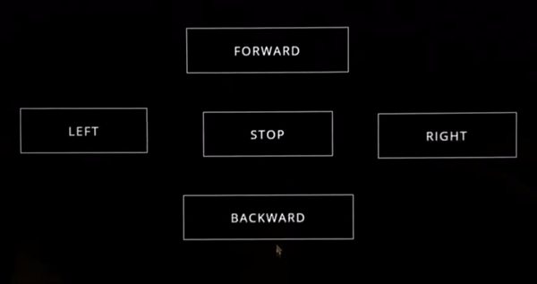

# Robot-Control-Panel

## What is a database? 
A database is information that is set up for easy access, management and updating. Computer databases typically store aggregations of data records or files that contain information, such as sales transactions, customer data, financials and product information.

## What are the components of a database? 
### Hardware: 
This is the physical device that database software runs on. Database hardware includes computers, servers and hard drives.
### Software
Database software or application gives users control of the database. Database management system (DBMS) software is used to manage and control databases.
### Data
This is the raw information that the database stores. Database administrators organize the data to make it more meaningful.
### Data access language 
This is the programming language that controls the database. The programming language and the DBMS must work together. One of the most common database languages is SQL.
### Procedures
These rules determine how the database works and how it handles the data

## Application Programming Interface 
API is the acronym for Application Programming Interface, which is a software intermediary that allows two applications to talk to each other. Each time you use an app like Facebook, send an instant message, or check the weather on your phone, you’re using an API.

## Hypertext Preprocessor
is a widely-used open source general-purpose scripting language that is especially suited for web development and can be embedded into HTML

## WebPage View 
 

 

## Start  
`php -S 127.0.0.1:8080`
## GET request 
`curl  http://localhost:8080/index.php/numbers/list\?limit\=20`
## POST request  
`curl --location --request POST 'http://localhost:8080/index.php/numbers/post' \
--form 'number="150"' `

