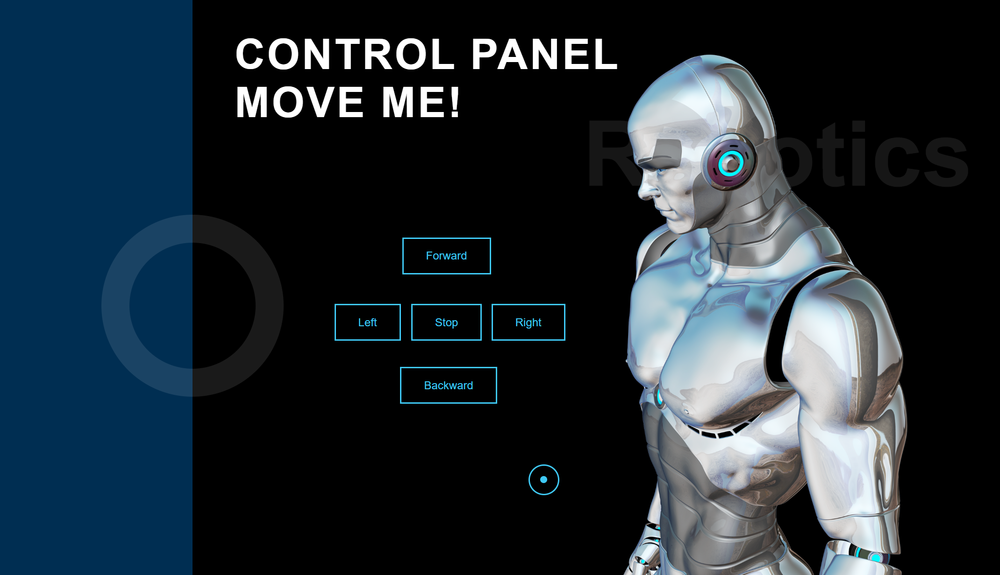

# Robot-Control-Panel

## About this repository❓
As you can see from the image below it is a control panel to control the movment of the robot 

## How the implementation process was done❓ 
I created a web page in HTML format containing a control panel for the robot then I connected the web page to a database. 

### There are options to control the movement of the robot which are: 
**○right** 
**○left** 
**○forward** 
**○backward** 
**○stop**

## WebPage View🔍 
 

 

